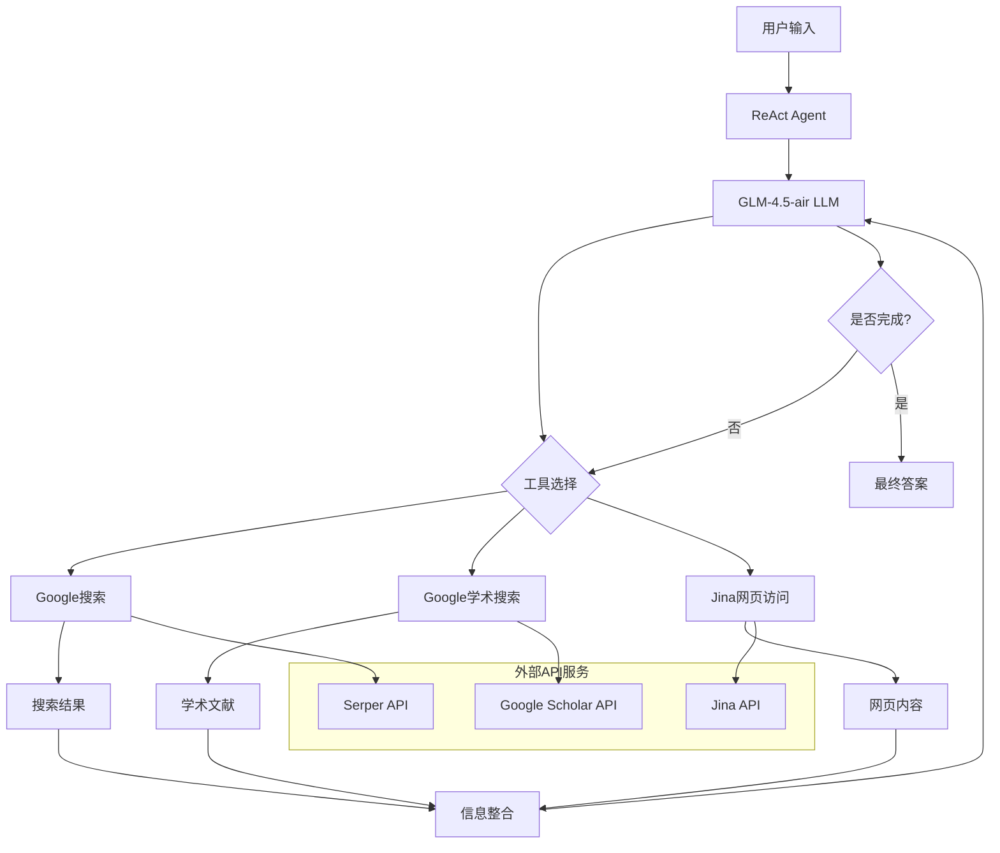

# ResearchAgent - AI 研究助手

这是一个基于 Qwen-Agent 框架的 AI 研究助手项目，集成了多种工具来支持信息检索、分析和处理。

## 功能特性

- ✅ **Google搜索**: 使用Serper API进行实时网络搜索
- ✅ **Google学术搜索**: 学术文献和论文检索
- ✅ **Jina网页访问**: 智能网页内容提取和摘要
- ✅ **ReAct Agent**: 基于推理和行动的智能研究代理
- ✅ **Qwen-Agent集成**: 完全兼容Qwen-Agent的BaseTool接口
- ✅ **智能格式化**: 将搜索结果格式化为易读的字符串
- ✅ **错误处理**: 完善的网络错误和API错误处理
- ✅ **超时控制**: 内置请求超时机制，防止长时间阻塞

## 系统架构



### 组件说明

#### ReAct Agent 核心组件
- **推理引擎**: GLM-4.5-air模型进行复杂推理
- **工具管理器**: 动态选择和执行合适的工具
- **上下文管理器**: 智能管理对话历史和上下文
- **结果处理器**: 整合多源信息并生成答案

#### 工具层
- **Google搜索工具**: 实时网络信息检索
- **Google学术工具**: 学术文献和论文搜索
- **Jina访问工具**: 网页内容智能提取和摘要

#### 外部服务
- **Serper API**: 高性能搜索引擎接口
- **Jina API**: 网页内容理解和摘要
- **GLM API**: 智能推理和文本生成

## 文件结构

```
├── inference/               # 核心推理工具
│   ├── __init__.py         # 包初始化文件
│   ├── google_search_tool.py    # Google搜索工具实现
│   ├── google_scholar_tool.py   # Google学术搜索工具
│   ├── jina_url_visit_tool.py   # Jina网页访问工具
│   └── react_agent.py          # ReAct Agent实现
├── tests/                   # 测试脚本
│   ├── __init__.py         # 测试包初始化
│   ├── test_google_search.py    # Google搜索工具测试
│   ├── test_jina_url_visit.py   # Jina网页访问工具测试
│   └── test_react_agent.py      # ReAct Agent测试
├── main.py                  # 项目主入口
├── example_usage.py         # 工具使用示例
├── example_react_agent.py   # ReAct Agent使用示例
└── README.md               # 文档
```

## 安装依赖

```bash
# 使用uv安装依赖
uv add qwen-agent python-dateutil openai
```

## 快速开始

### 🚀 5分钟快速体验

#### 1. 环境准备
```bash
# 克隆项目
git clone https://github.com/DennyChui/ResearchAgent.git
cd ResearchAgent

# 安装依赖
uv install

# 设置API密钥 (必需)
export GLM_API_KEY="your_glm_api_key_here"
```

#### 2. 快速测试
```bash
# 测试基础功能
uv run python main.py test

# 快速搜索
uv run python main.py search "人工智能最新发展"

# 智能研究
uv run python main.py research "区块链技术在金融领域的应用"
```

#### 3. 交互式体验
```bash
# 启动交互模式
uv run python main.py interactive
```

### 📖 详细使用指南

#### 1. 单独使用工具

```python
from inference import GoogleSearchTool, GoogleScholarTool, JinaURLVisitTool

# Google搜索
search_tool = GoogleSearchTool()
result = search_tool.call({"query": "Python编程教程"})
print(result)

# 学术搜索
scholar_tool = GoogleScholarTool()
papers = scholar_tool.call({"query": "machine learning research 2024"})
print(papers)

# 网页访问
visit_tool = JinaURLVisitTool()
content = visit_tool.call({
    "url": "https://www.python.org/about/",
    "goal": "了解Python的历史和特点"
})
print(content)
```

#### 2. ReAct Agent 智能研究

```python
from inference.react_agent import ReActAgent

# 创建智能研究代理
agent = ReActAgent()

# 进行深度研究
question = "分析量子计算在医疗诊断领域的最新进展和应用前景"
result = agent.research(question)

print("📋 研究报告:")
print("=" * 60)
print(result)
print("=" * 60)

# 查看研究统计
print(f"📊 研究统计:")
print(f"   - LLM调用次数: {agent.llm_calls}")
print(f"   - 消息总数: {len(agent.messages)}")
```

#### 3. 高级用法

```python
from inference.react_agent import ReActAgent
import logging

# 启用详细日志
logging.basicConfig(level=logging.INFO)

# 创建代理并设置自定义参数
agent = ReActAgent()

# 批量研究
research_questions = [
    "人工智能在医疗领域的应用",
    "可再生能源技术发展趋势",
    "量子计算商业化前景"
]

for i, question in enumerate(research_questions, 1):
    print(f"\n🔍 研究 {i}/{len(research_questions)}: {question}")
    result = agent.research(question)
    print(f"✅ 完成，结果长度: {len(result)} 字符")
    
    # 重置代理状态，准备下一个研究
    agent.reset()
```

### 🛠️ 命令行工具

```bash
# 基础搜索功能
uv run python main.py search "你的搜索关键词"

# 智能研究功能
uv run python main.py research "你的研究问题"

# 学术文献搜索
uv run python main.py search "深度学习 自然语言处理" --type scholar

# 网页内容提取
uv run python main.py search "https://example.com" --type visit

# 运行所有测试
uv run python main.py test

# 运行ReAct Agent示例
uv run python main.py react-example

# 交互式模式
uv run python main.py interactive

# 查看帮助信息
uv run python main.py help
```

### 4. 与Qwen-Agent Assistant集成

```python
from qwen_agent.agents import Assistant

# 配置LLM
llm_cfg = {
    'model': 'qwen-max',
    'model_type': 'qwen_dashscope',
    'api_key': 'YOUR_DASHSCOPE_API_KEY'
}

# 创建Assistant，包含Google搜索工具
assistant = Assistant(
    llm=llm_cfg,
    function_list=['google_search'],  # 使用注册的工具名称
    system_message="你是一个智能助手，可以使用Google搜索获取最新信息。"
)

# 使用助手进行搜索
messages = [{'role': 'user', 'content': '请搜索最新的AI发展趋势'}]
for response in assistant.run(messages=messages):
    print(response)
```

### 3. 自定义Agent集成

```python
from qwen_agent import Agent
from inference.google_search_tool import GoogleSearchTool

class SearchAgent(Agent):
    def _run(self, messages, **kwargs):
        # 使用Google搜索工具
        search_results = self._call_tool('google_search', {
            'query': messages[-1]['content']
        })

        # 返回搜索结果
        yield [{'role': 'assistant', 'content': search_results}]

# 创建Agent
agent = SearchAgent(
    function_list=[GoogleSearchTool()]
)
```

## 环境配置

### 必需的环境变量

```bash
# GLM-4.5-air LLM API (ReAct Agent必需)
export GLM_API_KEY="your_glm_api_key_here"

# 搜索服务API密钥 (可选，有默认值)
export SERPER_KEY_ID="your_serper_api_key_here"

# Jina API密钥 (可选，有默认值)
export JINA_API_KEY="your_jina_api_key_here"
```

### API配置详情

#### GLM-4.5-air (ReAct Agent)
- **模型**: GLM-4.5-air
- **API端点**: `https://open.bigmodel.cn/api/paas/v4`
- **获取API密钥**: [智谱AI开放平台](https://open.bigmodel.cn/)
- **必需**: ✅ 是 (ReAct Agent功能需要)

#### Serper Search API
- **服务**: Google搜索服务
- **API端点**: `https://google.serper.dev/search`
- **免费额度**: 每月2,500次请求
- **获取API密钥**: [Serper官网](https://serper.dev/)
- **默认密钥**: `2fb71d719108d02677a2d8492809a4922e766c3c`
- **必需**: ❌ 否 (有默认值)

#### Jina API
- **服务**: 网页内容提取和摘要
- **API端点**: `https://r.jina.ai/{url}`
- **免费额度**: 每月200,000次请求
- **获取API密钥**: [Jina官网](https://jina.ai/)
- **默认密钥**: `jina_0b07d5982d6f4ee287de16cc4b32981fTBZpS-i7feuvLyPdauhoeeIjX0XZ`
- **必需**: ❌ 否 (有默认值)

### 快速环境设置

```bash
# 创建环境变量文件
cat > .env << EOF
GLM_API_KEY=your_glm_api_key_here
SERPER_KEY_ID=your_serper_api_key_here
JINA_API_KEY=your_jina_api_key_here
EOF

# 加载环境变量
source .env
```

## 工具接口

### 属性
- `name`: `google_search`
- `description`: "Search Google for information using Serper API. Returns organic search results with titles, snippets, and links."
- `parameters`:
  ```json
  [
    {
      "name": "query",
      "type": "string",
      "description": "The search query to perform on Google",
      "required": true
    }
  ]
  ```

### 方法
- `call(params: Union[str, dict]) -> str`: 执行Google搜索

## 输出格式

搜索结果按以下格式返回：

```
A Google search for 'query' found N results (search time: X.XXs):

## Web Results

### 1. 结果标题
结果描述片段
🔗 结果链接

### 2. 结果标题
结果描述片段
🔗 结果链接
...
```

## 错误处理

工具包含完善的错误处理机制：

- **网络错误**: 连接超时、DNS解析失败等
- **API错误**: 认证失败、请求限制等
- **参数错误**: 空查询、无效参数格式等
- **数据错误**: JSON解析失败、数据格式异常等

## ReAct Agent 智能研究代理

### 特性

ReAct Agent 是一个基于推理和行动模式的智能研究代理，具备以下特性：

- 🧠 **智能推理**: 使用 GLM-4.5-air 模型进行复杂推理
- 🔍 **多工具协作**: 自动选择合适的工具组合
- 📚 **深度研究**: 系统性收集和分析信息
- 🔄 **迭代优化**: 基于 ReAct 循环不断改进研究质量
- 📊 **上下文管理**: 智能管理对话历史和上下文

### 工作流程

1. **理解问题**: 分析用户的研究需求
2. **制定策略**: 确定搜索策略和工具选择
3. **执行搜索**: 使用 Google 搜索、学术搜索、网页访问等工具
4. **分析结果**: 整合和分析收集到的信息
5. **生成答案**: 提供全面、准确的研究报告

### 使用示例

```python
from inference.react_agent import ReActAgent

# 初始化代理
agent = ReActAgent()

# 研究复杂问题
question = "人工智能在医疗诊断中的最新进展和应用案例"
result = agent.research(question)

print(result)
```

## 测试

运行测试脚本验证工具功能：

```bash
# 运行所有测试
uv run python main.py test

# 运行特定测试
uv run python tests/test_google_search.py
uv run python tests/test_react_agent.py
```

测试包括：
- ✅ 工具基本结构测试
- ✅ 参数处理测试
- ✅ 结果格式化测试
- ✅ Qwen-Agent集成测试
- ✅ ReAct Agent 完整流程测试

## 使用示例

查看完整的使用示例：

```bash
uv run python example_usage.py
```

示例包括：
- 直接工具调用
- Assistant集成
- 自定义Agent开发

## 性能和限制

### ReAct Agent 性能特性
- **最大LLM调用次数**: 100次 (防止无限循环)
- **上下文窗口管理**: 12,000 tokens (智能截断历史对话)
- **支持的工具**: Google搜索、Google学术、Jina网页访问
- **平均响应时间**: 3-10秒 (取决于查询复杂度)

### API限制
- **Serper API**: 每月2,500次免费请求
- **GLM-4.5-air**: 按token计费，详细费率请查看官方定价
- **Jina API**: 每月200,000次免费请求

### 常见问题和解决方案

#### 1. ReAct Agent 无法启动
```bash
# 确保设置了GLM API密钥
export GLM_API_KEY="your_api_key"
```

#### 2. 搜索结果不准确
- 尝试更具体的关键词
- 使用学术搜索获取专业信息
- 检查网络连接状态

#### 3. Jina API 超时
- Jina API在某些情况下可能超时
- 系统会自动重试5次
- 如果仍然失败，ReAct Agent会继续使用搜索结果

#### 4. 上下文过长
- 系统会自动截断早期对话
- 保留最近的8轮对话和系统消息
- 确保重要信息在最近的消息中

### 调试模式

```python
# 启用详细日志查看调试信息
import logging
logging.basicConfig(level=logging.DEBUG)

agent = ReActAgent()
result = agent.research("your question")
```

## 注意事项

1. **网络连接**: 工具需要稳定的网络连接来访问各种API服务
2. **API密钥**: 生产环境中必须设置环境变量，特别是GLM_API_KEY
3. **费用控制**: GLM-4.5-air按使用量计费，请监控API使用量
4. **超时设置**: 默认超时时间为10秒，可根据网络状况调整
5. **内容过滤**: 所有API服务都有内容政策，请遵守相关规定

## 开发说明

### 核心实现
- 继承`qwen_agent.tools.base.BaseTool`
- 使用`@register_tool('google_search')`装饰器注册工具
- 实现`call`方法处理搜索请求
- 使用Python标准库`http.client`进行HTTPS请求

### 设计原则
- **简洁性**: 代码结构清晰，易于理解和维护
- **健壮性**: 完善的错误处理和异常捕获
- **兼容性**: 完全兼容Qwen-Agent框架规范
- **性能**: 合理的超时控制和资源管理

## 许可证

本项目采用MIT许可证。

## 版本历史

### v0.2.0 (当前版本) - 2024-10-14
- ✨ **新增**: ReAct Agent智能研究代理
- ✨ **新增**: GLM-4.5-air LLM集成
- ✨ **新增**: 多格式工具调用检测
- ✨ **新增**: 智能上下文管理
- ✨ **新增**: Google学术搜索工具
- ✨ **新增**: Jina网页访问工具
- 🔧 **改进**: 更全面的测试覆盖
- 📚 **文档**: 完善的使用文档和示例

### v0.1.0 - 2024-10-13
- 🎉 **初始版本**: 基础Google搜索工具
- 🔧 **集成**: Qwen-Agent框架
- 📝 **文档**: 基础使用说明

## 开发路线图

### 即将推出 (v0.3.0)
- 🤖 **多模态支持**: 图像理解和生成
- 📊 **数据可视化**: 自动生成图表和报告
- 🔍 **高级搜索**: 语义搜索和知识图谱
- 💾 **本地存储**: 研究结果持久化
- 🌐 **多语言支持**: 国际化功能

### 长期规划 (v1.0.0)
- 🧠 **自定义Agent**: 用户可训练的专用代理
- 🔗 **API集成**: 更多第三方服务集成
- 📱 **Web界面**: 图形化用户界面
- ⚡ **性能优化**: 缓存和并发处理
- 🛡️ **安全增强**: 数据加密和隐私保护

## 贡献指南

我们欢迎各种形式的贡献！

### 如何贡献
1. **Fork** 本仓库
2. 创建特性分支 (`git checkout -b feature/AmazingFeature`)
3. 提交更改 (`git commit -m 'Add some AmazingFeature'`)
4. 推送到分支 (`git push origin feature/AmazingFeature`)
5. 创建 **Pull Request**

### 贡献类型
- 🐛 **Bug修复**: 修复现有功能问题
- ✨ **新功能**: 添加新的工具或功能
- 📚 **文档**: 改进文档和示例
- 🧪 **测试**: 增加测试覆盖率
- 🎨 **代码质量**: 代码重构和优化

### 开发环境设置
```bash
# 克隆仓库
git clone https://github.com/DennyChui/ResearchAgent.git
cd ResearchAgent

# 安装依赖
uv install

# 运行测试
uv run python main.py test

# 启动开发模式
uv run python main.py interactive
```

### 代码规范
- 遵循 PEP 8 Python代码规范
- 添加适当的注释和文档字符串
- 确保所有测试通过
- 保持向后兼容性

## 许可证

本项目采用 [MIT 许可证](LICENSE)。

## 联系方式

- **项目主页**: [https://github.com/DennyChui/ResearchAgent](https://github.com/DennyChui/ResearchAgent)
- **问题反馈**: [GitHub Issues](https://github.com/DennyChui/ResearchAgent/issues)
- **功能建议**: [GitHub Discussions](https://github.com/DennyChui/ResearchAgent/discussions)

## 致谢

感谢以下开源项目和服务：
- [Qwen-Agent](https://github.com/QwenLM/Qwen-Agent) - AI Agent框架
- [Serper](https://serper.dev/) - 搜索API服务
- [Jina AI](https://jina.ai/) - 网页内容提取
- [智谱AI](https://open.bigmodel.cn/) - GLM模型服务